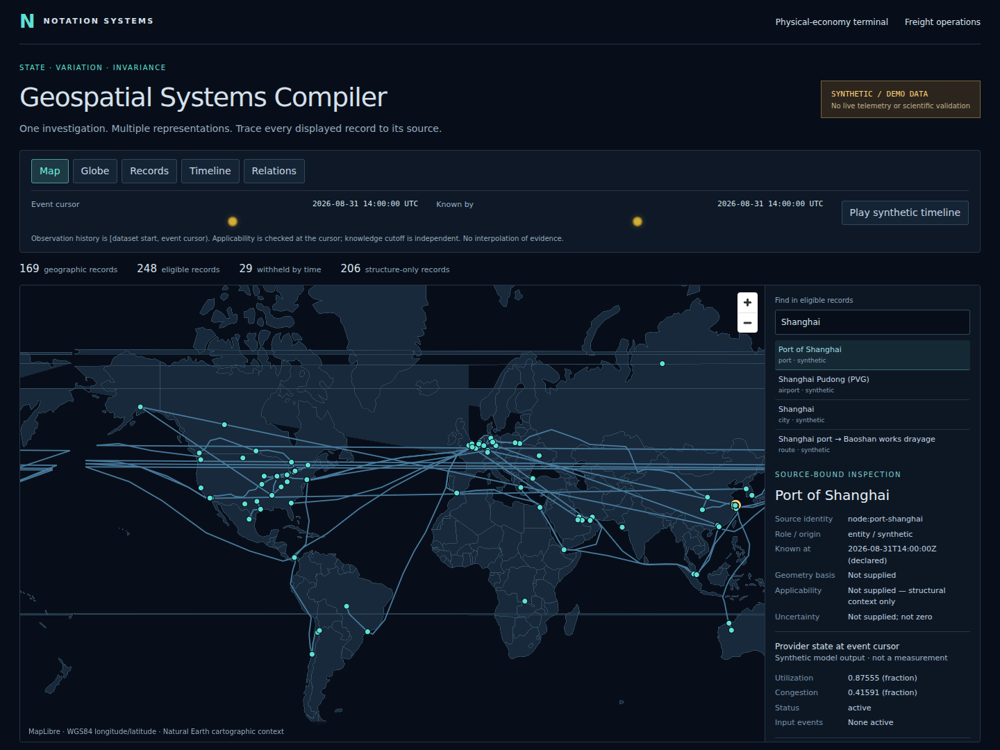
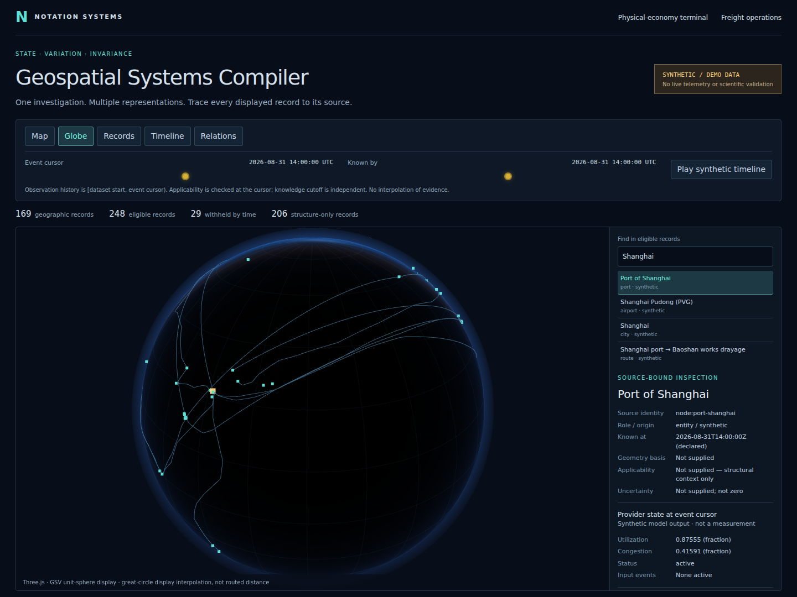

# Geospatial Systems Compiler

**Inspect physical-system records through synchronized maps, globes, tables and timelines.**

Geospatial Systems Compiler (GSC) is Notation Systems' visualization and investigation application. It combines the existing Payload browser/domain workflows with Geospatial State Visualization's provider, store and globe components. Both spatial backends consume the same source-bound intermediate representation; there is no iframe or second running GSV application.

**The public demonstration is synthetic.** It loads the original GSV dataset: 114 facilities, 55 routes and 277 source records in total. The event cursor and knowledge cutoff are independent. Changing views retains the selected source identity; records that are not eligible at those clocks are withheld rather than filled in.





## What it does

```text
GSV provider + WorldStore                  Payload domain records
              │                                     │
              └────────── source adapters ────────────┘
                                  │
                 identity · time · units · frames · provenance
                                  │
                         typed representation IR
                                  │
                     explicit temporal eligibility
                                  │
               MapLibre map ↔ Three.js globe ↔ records
                                  │
                       timeline · relations · inspector
```

| Implemented component | Concrete behavior |
| --- | --- |
| One investigation interface | Native map/globe switching, record search and inspection, independent event/knowledge clocks, synthetic playback, tables, timeline records and relation links. |
| Source adapters | GSV snapshots; Payload entities, observations, flows, capacities, dependencies and events. Original source detail is retained in unfiltered IR; it is removed from temporal display output to avoid nested future-history leaks. |
| Temporal selection | Checks source-known time, observation history `[from, at)`, declared applicability and source validity. Unknown structure is labelled context, not active physical state. Mixed date/instant comparisons are refused. |
| Provider state | Calls the original deterministic GSV provider at the explicit cursor. Values are labelled synthetic model outputs, not measurements. Unknown contributing model events make the numerical result unavailable. |
| Renderer lifecycle | Container-relative sizing, canvas-local picking, abortable initialization, listener/observer removal, animation cancellation and GPU-resource disposal. |
| Existing domain work | Original physical-economy terminal at `/terminal`; freight workspace at `/operations`; existing journals, APIs and authorization remain in place. |

Map and globe share the compiled identity, not just matching names. Selecting a record that later becomes ineligible retains the selection identity while withholding its values. Geometry remains tied to its declared frame and basis. A great-circle display interpolation is not a road route, ellipsoidal geodesic or uncertainty transformation.

## Run and inspect

```sh
npm ci
npm run dev
```

Open `/` or `/explorer`. For a bounded offline demonstration without domain-store warmup:

```sh
GSC_PUBLIC_DEMO=1 npm run dev
```

`GSC_PUBLIC_DEMO` suppresses startup acquisition/warmup only; **it is not an authorization policy and does not disable the inherited API routes**. Public deployments must not carry private operational credentials or assume that a record's presence grants permission to publish it. The new public demo does not call the legacy analytics middleware.

```sh
node scripts/test-gsc.mjs           # strict renderer-blind compiler tests
npm test                           # full suite, including migrated GSV regressions
npx tsc --noEmit
npm run build
# With a local server already running and Playwright Chromium installed:
node scripts/test-gsc-browser.mjs
```

The browser check exercises the actual map/globe canvases, selection preservation, model recomputation, source-time withholding, repeated mount/dispose, container resize and mobile layout. CI uses software WebGL; this is not physical-GPU performance qualification. Set `GSC_CHROMIUM` only when supplying a permitted local Chromium executable.

## Responsibility and current limits

GSC compiles **representations**, not source truth. It does not become the canonical evidence ledger, scientific runtime or execution/verification authority.

| Component | Responsibility |
| --- | --- |
| GSC | Source-bound representation, temporal selection, visualization and local investigation context. |
| Evidence and State Management (ESM) | Evidence retention, governed state, admission and release. |
| Notations Engineering Terminal / CIW | Existing instrument sessions, retained results and explicitly requested computation/replay. |
| Scientific Computation Runtime and instruments | Domain numerical methods, result contracts and verification within their declared scope. |

ESM release import and a live CIW spatial-service connection are **not connected by this consolidation**. Their public/private boundaries must be integrated against the actual upstream contracts, not guessed URLs or invented result schemas. No generic solver, source authentication, covariance propagation, vector/tensor-field renderer or live sensor feed is claimed.

GSV's data/store/provider, globe mathematics and rendering components are migrated with a source manifest. The new inspector does not yet reproduce every original cinematic command, GPU-flow particle view or layer preset. Those components remain available in the migrated library, rather than being deleted or falsely marked as migrated UI behavior. The preserved Payload domain workflow is available separately within this same Next application.

See [compiler and browser contracts](docs/GSC_COMPILER.md) and the [integration ledger](docs/GSC_INTEGRATION_LEDGER.md) for exact source pins, migration decisions and remaining parity gates. Package names, source namespaces, environment variables and retained evidence/operation identities are compatibility contracts, not display branding.

<!-- collection-policy:begin -->
## Collection policy

Payload is being built for a firm that will hold carrier, driver and customer
personal information. What the application is allowed to collect is therefore
part of its design, not a footnote to it.

**Prohibited, and removed from this tree:** username enumeration across
platforms, breach-corpus lookup by email address, infostealer credential
corpora, phone-number research, and host or port scanning. These were present
in the upstream project this fork began from. They are deleted — code, routes,
UI and client libraries — rather than disabled or feature-flagged, because a
feature-flagged breach lookup is still a breach lookup in the tree and still
in the image.

**Conditional, and permitted only with the condition written down:** WHOIS,
DNS, IP intelligence, certificate transparency, BGP/ASN and MAC-prefix
lookup. Each states the same constraint in its own source —
*organisational infrastructure attribution only; never used to profile a
person*. A conditional permission with the condition left implicit is an
unconditional permission.

**Permitted:** sanctions screening of counterparty **organisations, vessels
and aircraft**. The person path is not served, and is filtered out of every
result set rather than merely omitted from the schema allowlist.

Three checks hold this in place, and they run in CI:

- the **source registry** refuses to register a source that yields
  natural-person data;
- the **route-surface gate**
  ([`routeSurfacePolicy.test.ts`](src/lib/economy/routeSurfacePolicy.test.ts))
  classifies every route under `src/app/api/**`, fails on an unclassified
  one, and scans every route's source for a prohibited capability regardless
  of how it is labelled;
- the **shipped-description gate** fails if this README advertises a
  prohibited capability — the description is an artifact and drifts from
  policy like any other.

Registration was never the only door.
<!-- collection-policy:end -->

## Run the application

These commands start the consolidated GSC browser and preserved domain routes. Use Node.js 22
for consistency with the repository's container build.

```bash
git clone https://github.com/giasonpooni/Geospatial-Systems-Compiler.git
cd Geospatial-Systems-Compiler
npm install
npm run dev
```

Open [http://localhost:3000](http://localhost:3000).

```bash
npm test          # Vitest, including the policy gates
npx tsc --noEmit  # Type checking
npm run build    # Production build
```

The inherited shipped-description checks remain on the test path:

```bash
npm test -- src/lib/economy/routeSurfacePolicy.test.ts
```

### Docker / self-hosting

Create an optional `.env` with the supported settings below. The current Compose
file expects an external network named `umami_default`; provision it first if
it does not already exist.

```bash
docker network inspect umami_default >/dev/null 2>&1 || docker network create umami_default
docker compose up -d --build
```

The image uses a multi-stage `node:22-alpine` standalone build and a non-root
application user. The container listens on `3000`; `PAYLOAD_PORT` controls the
published host port. Compose provisions a persistent freight-journal volume.
See [DOCKER.md](DOCKER.md) for additional deployment details; some inherited
naming and setup references there still need alignment with this repository.

### Environment and freight operations

Some existing data paths use public, keyless sources; others need credentials
or return unavailable results. Keyless does not guarantee live availability.
Private freight commands require their own configuration and are not part of
the proposed public explorer.

Use the following settings as needed in `.env`. The checked-in
[`.env.example`](.env.example) also contains legacy entries and comments; it is
not a declaration that all of those inherited capabilities are supported.

```env
# Published host port; container always listens on 3000
PAYLOAD_PORT=3000

# Force source snapshot fallback, visible in provenance
PAYLOAD_DISABLE_LIVE=

# Leave the operations token empty to disable the private operations API
PAYLOAD_OPERATIONS_TOKEN=
PAYLOAD_OPERATIONS_LOG=

# Carrier authority/status and weekly diesel benchmark
FMCSA_WEB_KEY=
EIA_API_KEY=
PAYLOAD_FREIGHT_SOURCE_TIMEOUT_MS=10000

# Outbound carrier adapter and authenticated inbound carrier events
PAYLOAD_CARRIER_DISPATCH_URL=
PAYLOAD_CARRIER_DISPATCH_TOKEN=
PAYLOAD_CARRIER_DISPATCH_PROVIDER=carrier-webhook
PAYLOAD_CARRIER_DISPATCH_TIMEOUT_MS=10000
PAYLOAD_CARRIER_WEBHOOK_SECRET=
PAYLOAD_CARRIER_COMMUNICATIONS_LOG=
```

`GET /api/freight/operations` reads current load-operation projections;
`POST /api/freight/operations` advances intake, alternatives, authorization,
assignment, dispatch evidence, and settlement outcome capture.
`GET /api/freight/control-tower` joins these records to tender delivery,
acknowledgements, tracking freshness, delivery windows, and settlement state.
The `/operations` workspace refreshes that private view every 30 seconds and
keeps its bearer credential only in the active browser tab's memory.

`GET /api/freight/sources?usdot=<number>&carrierId=<internal-id>&includeDiesel=1`
pulls FMCSA identity/authority/out-of-service evidence and the EIA weekly U.S.
diesel benchmark. It returns an `authorizationCarrier` object but leaves cargo
insurance expiry and limit null: missing coverage never becomes clearance.

`POST /api/freight/communications` delivers the journal-derived tender to the
configured carrier adapter with a stable `Idempotency-Key`; its corresponding
`GET` exposes delivery and carrier-event projections. These private routes
require `Authorization: Bearer <PAYLOAD_OPERATIONS_TOKEN>`.

The carrier adapter must return JSON containing `receiptId` and optionally
`acceptedAt`. It receives only the selected carrier rate and sanitized load
facts—not the shipper target rate or source-message identity. Carriers post
acknowledgements and tracking updates to `/api/freight/carrier-events`, signed
as `HMAC-SHA256(timestamp + "." + rawBody)` using
`PAYLOAD_CARRIER_WEBHOOK_SECRET` (at least 32 random bytes). Run both journals
on persistent, backed-up storage with one application writer.

FMCSA and EIA keys stay server-side and are not included in evidence identifiers
or source errors. Partial upstream failure returns a typed source refusal, not
an inferred compliance pass. Do not expose operational credentials in public
site configuration, demonstration artifacts, or navigation links.

> **Compatibility:** existing `PAYLOAD_*` settings and Payload identifiers
> remain in use. The documented `OSIRIS_*` migration aliases are temporary;
> the existing compatibility window ends after `v0.2.0`. This README change
> does not rename packages, environment variables, routes, or retained records.
>
> `SCANNER_URL` and `SCANNER_KEY` refer to a removed backend. Do not configure
> them even where inherited setup examples still contain those entries.

## Technology and implementation references

| Layer | Technology |
| --- | --- |
| Application | Next.js 16 App Router, React, TypeScript 5 |
| Map | MapLibre GL JS / WebGL |
| Interface | Framer Motion, Lucide React |
| Tests | Vitest |

See the [physical-economy design](docs/PHYSICAL_ECONOMY.md),
[architecture ledger](docs/ARCHITECTURE_LEDGER.md),
[deployment guide](DOCKER.md), and [security policy](SECURITY.md).
Cross-repository links describe ownership boundaries, not a connected private service or public scientific execution endpoint.

## Origin and license

This project began as a fork of
[simplifaisoul/osiris](https://github.com/simplifaisoul/osiris), an open-source
situational-awareness dashboard, and retains its map and rendering foundation.
It was subsequently developed around provenance-preserving physical-economy
records and freight workflows. Those remain the preserved `/terminal` and freight-domain application. The shared investigation interface now uses a typed compiler and native MapLibre/Three.js backends.

The upstream project is MIT-licensed; its permissive grant and retained notice
continue to apply to inherited code. This project as a whole is distributed
under the **GNU General Public License v3.0**—see [LICENSE](LICENSE).
GSV components imported under `packages/gsv` retain their GPL-3.0 license and pinned attribution in `packages/gsv/ORIGIN.json`. Existing inherited notices are unchanged.
