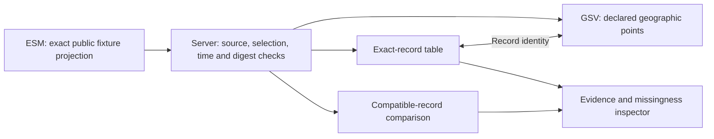

# Notation Systems · Visual Inspection

**Geospatial Systems Compiler** (the existing Payload Terminal application) — visualize physical systems, compare declared records,
and inspect the evidence behind them.

**State · Variation · Invariance**


*Companion GSV synthetic-demo view, retaining its earlier display branding.
This image is not a screenshot of an ESM-connected production deployment.*

The repository was previously named `Payload-Terminal-V0`. Existing package names,
Payload routes and retained record identities remain compatible.

The terminal is Notation Systems' browser interface for geographic inspection,
recorded-value comparison and evidence review. It connects visual views to exact
records instead of turning a picture into a new source of truth. ESM governs
evidence and release state; GSV provides geographic visualization; the existing
workbench and instruments retain scientific execution.

## Start with the view, keep the evidence

| Experience | Implemented scope |
| --- | --- |
| **Company entry — `/notation`** | Visualization-first introduction; readable without ESM or WebGL. The introductory graphic is labelled as a schematic, not measured data. |
| **Visual explorer — `/explore`** | One explicitly configured public ESM fixture projection; exact release, source snapshot, selection and knowledge/valid times. Unavailable by default until configured. |
| **Geographic view** | A separately built GSV embed displays declared WGS84 points. Selection is synchronized with the record table; unsupported boundary display does not invent coordinates. |
| **Value comparison** | Explicit baseline/candidate selection, shared-scale plot, signed difference and relative difference. Requires the same subject, predicate, unit, basis and projection time. |
| **Diagnostics and evidence** | Counts missing units, uncertainty and geometry; exposes source records, declarations, status, rights and original geometry. These counts are not quality scores. |
| **Existing Payload application — `/` and `/operations`** | Map-led commodity and freight workflows, durable operating records, authority checks and exception handling remain available. |

**Current limits:** the ESM adapter consumes fixture-only projections, not general
live scientific results. Polygon and extent declarations are checked and retained
in the inspector, but the new embed draws only literal points. It supplies no
inferred operational state, covariance, confidence interval or solver execution.
The connected experience needs a separately served GSV build and an explicitly
reviewed projection. This repository does not deploy either service automatically.

## One projection across the interface



The browser changes selection and presentation, not evidence class or release
identity. A time change requires another explicit ESM projection. The viewer
accepts no execution commands or credentials. Evidence, operation specification,
execution attempt, result and verification identities remain separate.

### State

Inspect the supplied value, unit, source, validity and knowledge cutoff. Missing
geometry is visibly unavailable; missing uncertainty is not replaced by zero.
Multiple source positions stay distinct rather than being silently averaged.

### Variation

Select two current records. The descriptive difference is `candidate - baseline`;
relative difference divides by the absolute baseline value. A zero baseline has
no relative result. Incompatible quantities and numerical overflow refuse with
an explicit reason. Unit conversion, record fusion and causal inference are not
performed. Input uncertainty is retained; uncertainty of a difference is not
invented without a joint uncertainty model.

### Invariance

Preserve source, release, record and time bindings while moving between table,
plot and geographic view. These are interface/contract invariants. Conservation
laws, calibrated uncertainty, model validity and other physical invariants must
be evaluated by the relevant instruments, not inferred from a convincing image.

## Run it

Use Node.js 24 to run the contract tests as written.

```sh
git clone https://github.com/giasonpooni/Geospatial-Systems-Compiler.git
cd Geospatial-Systems-Compiler
npm ci
npm run dev
```

Open `/notation` for the company entry, `/explore` for configured visual
inspection, or `/` for the existing Payload application. The current root route
is preserved; making the company entry the deployed homepage is a separate
routing/deployment cutover, not an implicit change to operating workflows.

[Explorer configuration and boundaries](docs/NOTATION_EXPLORER.md) explain the
exact ESM projection pin and companion GSV embed. [Existing application setup and
freight operations](docs/PAYLOAD_OPERATIONS.md) retain Docker, feed-key, journal,
authorization, carrier-adapter and webhook instructions. Do not put operating
credentials in public configuration or browser messages.

```sh
node --test tests/explorer/*.node.mjs   # consumer, loader and descriptive comparison
node scripts/check-gsv-contract.mjs   # exact mirrored contract hash
node scripts/check-replacement-ledger.mjs
npm test                              # existing domain and policy gates
npx tsc --noEmit
npm run build
```

The new contract tests use hand-authored public fixtures, not private ESM corpus
exports. The GSV browser job checks the actual built embed. Passing a unit test
does not establish a deployed integration or scientific validation; CI reports
build and browser results separately.

## Replace foundations by demonstrated capability

Development adds explicit data contracts, numerical comparisons, diagnostics and
instrument adapters alongside retained workflows. Existing functions are not
removed merely because a new interface or name exists. A replacement needs its
own input/output contract, numerical or domain tests, failure behavior and a
migration check before the old path can be retired.

The [capability replacement ledger](docs/REPLACEMENT_LEDGER.md) records the current
alternatives, remaining gaps and retirement gates. Its machine-readable inventory
protects named existing paths and notices. **No legacy capability is declared
retired in this increment.**

Next scientific integrations are recorded instrument results and their declared
units/frames, covariance and validation artifacts, followed by contextual
workbench handoff. They extend existing instrument contracts; the terminal does
not acquire a competing solver, canonical store or execution history.

## Components

| Component | Responsibility |
| --- | --- |
| This repository | Browser navigation, record selection, presentation and descriptive comparison. |
| [Geospatial State Visualization](https://github.com/giasonpooni/Geospatial-State-Visualization) | Geographic visualization, retained CIW context provider and bounded ESM-record embed. |
| [Evidence and State Management](https://github.com/giasonpooni/Evidence-and-State-Management) | Retained evidence, source/version identity, admission and release governance. |
| [Computational Instrumentation Workbench](https://github.com/giasonpooni/Computational-Instrumentation-Workbench) | Existing sessions, instruments, execution/replay interfaces and result inspection. |
| Specialist scientific instruments | Domain methods, state estimation, geometry, covariance and method-specific validation. |

The existing application uses Next.js, React, TypeScript, MapLibre and Vitest.
The companion viewer uses Three.js and Vite. Package identities, Payload record
identities, existing routes and licenses are not changed by the new branding.

<!-- collection-policy:begin -->
## Collection policy

Payload is being built for a firm that will hold carrier, driver and customer
personal information. What the application is allowed to collect is therefore
part of its design, not a footnote to it.

**Prohibited, and removed from this tree:** username enumeration across
platforms, breach-corpus lookup by email address, infostealer credential
corpora, phone-number research, and host or port scanning. These were present
in the upstream project this fork began from. They are deleted — code, routes,
UI and client libraries — rather than disabled or feature-flagged, because a
feature-flagged breach lookup is still a breach lookup in the tree and still
in the image.

**Conditional, and permitted only with the condition written down:** WHOIS,
DNS, IP intelligence, certificate transparency, BGP/ASN and MAC-prefix
lookup. Each states the same constraint in its own source —
*organisational infrastructure attribution only; never used to profile a
person*. A conditional permission with the condition left implicit is an
unconditional permission.

**Permitted:** sanctions screening of counterparty **organisations, vessels
and aircraft**. The person path is not served, and is filtered out of every
result set rather than merely omitted from the schema allowlist.

Three checks hold this in place, and they run in CI:

- the **source registry** refuses to register a source that yields
  natural-person data;
- the **route-surface gate**
  ([`routeSurfacePolicy.test.ts`](src/lib/economy/routeSurfacePolicy.test.ts))
  classifies every route under `src/app/api/**`, fails on an unclassified
  one, and scans every route's source for a prohibited capability regardless
  of how it is labelled;
- the **shipped-description gate** fails if this README advertises a
  prohibited capability — the description is an artifact and drifts from
  policy like any other.

Registration was never the only door.
<!-- collection-policy:end -->

## Engineering references and license

[Physical-economy implementation](docs/PHYSICAL_ECONOMY.md) ·
[Architecture ledger](docs/ARCHITECTURE_LEDGER.md) ·
[Explorer integration](docs/NOTATION_EXPLORER.md) ·
[Replacement ledger](docs/REPLACEMENT_LEDGER.md) ·
[Security policy](SECURITY.md)

GNU General Public License v3.0 — see [LICENSE](LICENSE).
Historical lineage and the retained upstream MIT notice are documented in
[Origin and retained notices](docs/ORIGIN.md). This integration does not relicense
inherited code or claim that the legacy application's foundations are fully replaced.
